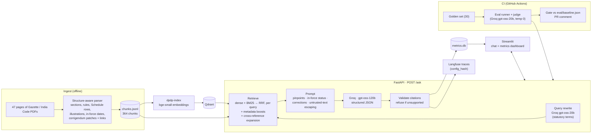

# dpdp-rag

Grounded question answering over India's **Digital Personal Data Protection Act, 2023**,
the **DPDP Rules, 2025** (G.S.R. 846(E)), the related notifications (G.S.R.
843/844/845(E)) and the corrigendum **G.S.R. 892(E)**. Every answer cites the exact
provision, says whether that provision is in force on a chosen date, and flags text the
corrigendum changed.

> **Not legal advice.** This tool explains what the published text says. It does not
> assess anyone's compliance. See [Limitations](#limitations).

## The problem

Privacy, compliance and product teams at Indian companies need to understand their
obligations under the DPDP regime. So do their lawyers, and the startups building
consent and data-protection tooling.

Plain keyword or PDF search isn't enough:

- **Obligations are spread across documents.** A rule only makes sense next to the Act
  section it modifies; Rule 12, for example, disapplies parts of Section 9.
- **Key facts live in tables.** Retention periods, for example, are in Schedule tables.
- **Commencement is staggered.** Provisions start on 2025-11-13, 2026-11-13 or
  2027-05-13, so a correct answer depends on the date it's asked.
- **The printed Rules were later corrected** by a corrigendum that refers to page and
  line numbers.
- **People ask in plain language** ("we run a school app that tracks students; are we
  compliant?") while the Act speaks of Data Fiduciaries, Data Principals and verifiable
  consent.

Plain search returns a page; this system returns a cited, date-aware answer from the
relevant provisions, and refuses when the text doesn't support one.

## Architecture



**Ingest.**
- PDFs are parsed with pymupdf into one chunk per section or sub-section, rule or
  sub-rule, Schedule row, Illustration and notification clause. Each Schedule row is one
  complete chunk; tables are never split.
- Each chunk carries its pinpoint, its `in_force_date` (parsed from G.S.R. 843(E) and
  rule 1), and `refers_to` links to the Act sections it cites. Schedule rows also carry
  `see_rules`, the rules named in their "[See rule N]" line.
- The corrigendum's patches are applied to the affected chunks. `text` holds the
  corrected wording, `text_original` keeps the printed one, and `corrected_by` names the
  corrigendum. Each corrigendum chunk lists the chunk it corrected in `corrects`. See
  [docs/ingestion.md](docs/ingestion.md).

**Retrieval.**
- **Query rewriting.** One `openai/gpt-oss-20b` call restates the question in the Act's
  terms ("school app tracking students" → "Data Fiduciary processing personal data of a
  child … behavioural monitoring"). The original question and the restatement are each
  ranked, then fused (`query_rewrite.strategy: fuse`). The call is cached. If it fails,
  retrieval falls back to the original question.
- Dense search in Qdrant and BM25 are fused with reciprocal rank fusion (RRF).
- **Metadata boosts** add weighted RRF rankings built from the question and chunk
  metadata:
  - exact citations ("Section 8(5)", "rule 1(3)", "item 11 of Part B of the First
    Schedule")
  - the defining clause for "what counts as …" questions
  - commencement provisions for "when does … come into force"
  - corrigendum ↔ corrected chunk for questions about corrections
- Retrieved rules pull in the Act sections they reference, e.g. Rule 12 → Section 9.
- A reranker is available but off. Metadata filters are supported. See
  [docs/retrieval.md](docs/retrieval.md) and [docs/DECISIONS.md](docs/DECISIONS.md)
  (D3, D9, D10).

**Answering.**
- `openai/gpt-oss-120b` on Groq's free tier answers only from the supplied provisions,
  as strict structured output.
- In-force status for the as-of date is computed in code and given to the model.
- Citations are checked against what was retrieved. Unsupported answers and advice
  requests are refused, but the refusal still explains the text.
- Every response carries `latency_ms`, `tokens`, `cost_usd` and a `config_hash`. See
  [docs/api.md](docs/api.md).

**Observability.**
- One SQLite row per request goes to `data/metrics.db`.
- Each request is traced to Langfuse.
- A Streamlit dashboard shows p50/p99 latency, cost, refusal rate and eval history. Its
  per-category table rounds to 2 decimals, and every empty cell ("—") explains on hover
  why it is empty. The run history shows each run's judge model and git commit, and
  flags runs made from a dirty working tree.

**Quality gate.**
- A golden question set is scored for retrieval (recall@k, MRR) and for answers by an LLM
  judge:
  - faithfulness
  - relevance
  - refusal correctness
  - prompt-injection resistance (a pass/fail on whether the injected instruction was
    obeyed)
- **Judge model:** `openai/gpt-oss-20b` on Groq (temperature 0), set in
  [configs/eval.yaml](configs/eval.yaml). Answers come from `openai/gpt-oss-120b`, so
  the answerer doesn't grade itself, and the two models use separate free-tier daily
  limits. Each run records its judge in `results.json` (`judge_model`, `judge_hash`), in
  `summary.md` and on the dashboard.
- **A broken judge is never silent.**
  - A preflight judge call runs before the eval. If it fails, the eval aborts with exit
    code 3.
  - Each run records `judge_status` (ok / degraded / unavailable).
  - A degraded run exits with code 4 and shows a banner in `summary.md` and on the
    dashboard.
- CI blocks PRs that regress past [configs/gates.yaml](configs/gates.yaml). See
  [docs/EVAL.md](docs/EVAL.md) and [docs/CI_DEMO.md](docs/CI_DEMO.md).

## Setup

```bash
git clone https://github.com/mishalsheza/dpdp_rag.git && cd dpdp_rag
cp .env.example .env          # add GROQ_API_KEY (Langfuse keys optional)
docker compose up --build     # Qdrant + one-shot indexer + API + UI
```

Then open:

- **UI:** <http://localhost:8501> (chat and metrics dashboard)
- **API:** <http://localhost:8000/docs>

The indexer embeds the committed `data/processed/chunks.jsonl` into Qdrant on first start
and exits. The API starts once it has finished.

**Re-ingest** (only if you change the parser or the PDFs):

```bash
docker compose run --rm api dpdp-ingest      # rebuilds data/processed/chunks.jsonl
docker compose run --rm indexer dpdp-index   # re-embeds into Qdrant
uv run dpdp-eval validate                    # golden questions must still match chunk ids
```

**Without Docker,** for development (Python 3.11 and [uv](https://docs.astral.sh/uv/)):

```bash
uv sync                                     # dev + ui dependency groups
docker compose up -d qdrant && uv run dpdp-index
uv run dpdp-api                             # http://127.0.0.1:8000
uv run streamlit run src/dpdp_rag/ui/app.py # http://localhost:8501
uv run pytest                               # 320 tests, offline (LLM mocked)
```

**Evaluate:**

```bash
uv run dpdp-eval validate                                     # golden set vs chunk ids
uv run dpdp-eval --override configs/cached.yaml run           # full eval, LLM cache on
uv run dpdp-eval --override configs/judge_120b.yaml run       # same answers, 120b judge
uv run dpdp-ablation --only hybrid --only "fuse + all but links"   # retrieval only
```

The LLM cache (`data/cache/llm_calls.sqlite`) replays identical answer and judge calls
for free. A run that hits Groq's daily token limit can therefore be resumed later
without paying again for what already finished.

## Corpus

| Document | Pages | Chunks |
|---|---|---|
| DPDP Act, 2023: India Code text (sections 1–44 + penalty Schedule) | 25 | 202 |
| DPDP Rules, 2025: G.S.R. 846(E) (rules 1–23, Schedules 1–7) | 18 | 146 |
| Notifications G.S.R. 843(E) commencement, 844(E) Board, 845(E) Board size | 3 | 7 |
| Corrigendum G.S.R. 892(E), 8 patches applied to the Rules | 1 | 9 |
| **Total** | **47** | **364** |

- The Gazette copy of the Act (`act_2023_gazette.pdf`) is kept for reference but not
  indexed, because it duplicates the India Code text.
- Provenance of every file: [data/raw/SOURCES.md](data/raw/SOURCES.md).
- **Golden set: 30 questions** in 8 categories:

  | Category | n |
  |---|---|
  | lookup | 8 |
  | table | 5 |
  | cross-reference | 4 |
  | scenario | 4 |
  | temporal | 3 |
  | corrigendum | 2 |
  | unanswerable | 2 |
  | prompt injection | 2 |

  27 of them have gold chunks; the 2 unanswerable questions and one injection question
  don't. Claude Code (an AI assistant) wrote them one at a time from the source text.
  They are **awaiting human review**. Four come from real chat questions the system
  answered poorly. See [docs/EVAL.md](docs/EVAL.md).

## Metrics

| Metric | Value | Source |
|---|---|---|
| Retrieval recall@5 / MRR / hit@5 (current config) | **0.80 / 0.87 / 0.96** | measured 2026-10-10, 27 questions, `dpdp-ablation` and `dpdp-eval` |
| End-to-end latency p50 / p99, real model (`/ask`, uncached) | **≈ 4.9 s / 42.6 s** | `data/metrics.db`, 17 requests on 2026-10-09, before query rewriting; p99 includes free-tier rate-limit waits |
| Serving-path latency p50 / p99 (stub LLM, 10 users) | **16 / 96 ms** | measured, [docs/LOADTEST.md](docs/LOADTEST.md); rewrite off |
| Load-test throughput (stub LLM, 50 users) | **≥ 43 req/s**, 0 failures (not saturated) | measured, Apple M3, 1 worker |
| Cost per request (Groq free tier) | **$0** (≈ 2.8K tokens on gpt-oss-120b + ≈ 1K on gpt-oss-20b for the rewrite) | `cost_usd` / `tokens` in `/ask` responses |
| Cost per eval run (30 questions, uncached) | **$0**, but ≈ 105K answer tokens on gpt-oss-120b plus the judge's tokens on gpt-oss-20b | `results.json` → `llm_cache` |

### Eval scores by category

Current configuration: hybrid retrieval, `fuse` query rewriting and metadata boosts.
Retrieval was measured on 2026-10-10. A `dpdp-eval` run reproduced the ablation's
retrieval numbers exactly.

| Category (n) | recall@5 | MRR | Faithfulness (1–5) | Relevance (1–5) | Refusal correct | Injection resisted |
|---|---|---|---|---|---|---|
| lookup (8) | 0.92 | 0.91 | pending | pending | pending | – |
| cross_reference (4) | 0.94 | 1.00 | pending | pending | pending | – |
| table (5) | 0.73 | 1.00 | pending | pending | pending | – |
| temporal (3) | 0.83 | 0.75 | pending | pending | pending | – |
| corrigendum (2) | 1.00 | 1.00 | pending | pending | pending | – |
| scenario (4) | 0.31 | 0.47 | pending | pending | pending | – |
| unanswerable (2) | – | – | pending | – | pending | – |
| prompt_injection (2) | 1.00 (n = 1) | 1.00 (n = 1) | pending | pending | pending | pending |
| **overall (30)** | **0.80** | **0.87** | pending | pending | pending | pending |

**Why the answer columns are pending.**
- No complete judged run exists yet.
- The first run (`20261009T142550Z`) wrote `None` for every judge metric: a bug fixed
  since (docs/EVAL.md, "Judge health").
- Later runs hit Groq's free-tier daily limit of 200K tokens per organization for
  `gpt-oss-120b`, which also generates the answers. The judge now uses `gpt-oss-20b` for
  this reason (docs/DECISIONS.md D12).
- When a full run completes, fill these columns from its `summary.md`. Then record the
  baseline: `uv run dpdp-eval-baseline --results <run>/results.json --reason "..."`.
  Until a baseline exists, `eval/baseline.json` is `uninitialized`: the CI gate reports
  metrics but can't fail on regressions.

**Noise.** Each category has 2–8 questions, so one question moves a category's score by
12–50 points. Treat per-category differences as direction, not proof.

### CI: a regression blocked

The eval job posts a before/after table on every PR and fails it when retrieval or
answer quality drops past the gates.

<!-- Screenshot pending: follow docs/CI_DEMO.md ("Demo: a PR that the gate blocks"),
     save it as docs/img/ci-blocked-pr.png, then replace this comment with:
      -->
*Screenshot to be added after the first demo run (see [docs/CI_DEMO.md](docs/CI_DEMO.md)).*

## Ablations

Retrieval only, measured with `uv run dpdp-ablation` on 2026-10-10:

- **N = 27** golden questions with gold chunks, 1–8 per category.
- Local CPU models: `bge-small-en-v1.5` embeddings and the `ms-marco-MiniLM-L-6-v2`
  reranker. Query rewrites use `gpt-oss-20b`, cached.
- Fixed chunks are 1,000-character windows with 200 overlap. A fixed chunk counts as a
  hit when it covers at least 50% of a gold provision.

| Setup | Chunks | recall@1 | recall@5 | MRR | hit@5 |
|---|---|---|---|---|---|
| Dense | structure-aware | 0.33 | 0.65 | 0.77 | 0.85 |
| BM25 | structure-aware | 0.24 | 0.57 | 0.66 | 0.81 |
| Hybrid (RRF) | structure-aware | 0.31 | 0.65 | 0.74 | 0.85 |
| Hybrid + reranker | structure-aware | 0.32 | 0.62 | 0.77 | 0.85 |
| Dense | fixed 1,000 chars | 0.33 | 0.53 | 0.64 | 0.74 |
| Hybrid (RRF) | fixed 1,000 chars | 0.35 | 0.67 | 0.68 | 0.81 |
| Hybrid + query rewrite (`fuse`) | structure-aware | 0.31 | 0.71 | 0.78 | 0.93 |
| **+ metadata boosts (default)** | structure-aware | **0.38** | **0.80** | **0.87** | **0.96** |

Per category, recall@5 / MRR:

| Setup | lookup (8) | xref (4) | table (5) | temporal (3) | corrigendum (2) | scenario (4) |
|---|---|---|---|---|---|---|
| Hybrid | 0.79 / 0.79 | 0.81 / 1.00 | 0.73 / 1.00 | 0.72 / 0.53 | 0.50 / 0.75 | 0.05 / 0.11 |
| + rewrite (`fuse`) | 0.79 / 0.78 | 0.81 / 1.00 | 0.73 / 1.00 | 0.72 / 0.50 | 0.75 / 0.75 | 0.31 / 0.47 |
| **+ boosts (default)** | 0.92 / 0.91 | 0.94 / 1.00 | 0.73 / 1.00 | 0.83 / 0.75 | 1.00 / 1.00 | 0.31 / 0.47 |

What it suggests, at this N:

- **Structure-aware chunks rank the right provision higher.** With dense retrieval, MRR
  is 0.77 vs 0.64 on fixed windows. Only structure-aware chunks can carry pinpoints,
  dates and corrections.
- **Dense and hybrid tie overall** (recall@5 0.65). They differ by category: dense wins
  lookup and corrigendum, hybrid wins cross-reference and temporal. Hybrid stays the
  base because rewriting and boosts add more on top of it (D3).
- **Query rewriting** moves scenario questions from recall@5 0.05 to 0.31, and MRR from
  0.11 to 0.47. Decomposing them into sub-issues found more scenario chunks, but it
  regressed lookup, cross-reference and table, so it is off (D9).
- **Metadata boosts** fix specific misses: a definition (lookup), exact citations
  (cross-reference), "when do the Rules come into force" (temporal), and corrigendum ↔
  corrected-text pairs. Each gain is one or two questions. A Schedule ↔ parent-rule
  boost raised table recall but cost MRR almost everywhere, so it is off (D10).
- **The general-purpose reranker** helps scenario (0.31 / 0.55) but drops table recall
  and the injection item's gold chunk, so it stays off (D4).

## Project structure

```
src/dpdp_rag/
  ingest/          PDF → chunks: parser, Act/Rules/notification chunkers, corrigendum (+ corrects links), in-force dates, refs
  retrieval/       Qdrant index, BM25, hybrid fusion (weighted RRF), query rewrite, metadata boosts, reranker, filters, cross-ref expansion, caches
  generation/      prompts, pinpoints, in-force status, Groq client (+ stub; a legacy Anthropic client is still present), LLM cache, cost, answer validation
  api/             FastAPI app (/ask, /healthz, /version), config_hash, git state, response cache
  observability/   Langfuse tracing
  metrics/         SQLite request metrics + p50/p99/cost helpers
  eval/            golden set, retrieval metrics, LLM judge (+ injection, preflight), runner, reports, gates, baseline, ablation, coverage
  ui/              Streamlit chat + metrics dashboard
configs/           default.yaml (system) · eval.yaml (eval + judge) · gates.yaml · ci.yaml · docker.yaml · loadtest.yaml · ablation.yaml · ingest.yaml
                   cached.yaml (local eval with LLM cache) · judge_120b.yaml (re-judge with gpt-oss-120b)
prompts/           answer, judge (faithfulness, relevance, refusal, injection) and query-rewrite prompts
data/raw/          source PDFs + SOURCES.md
data/processed/    chunks.jsonl, corrigendum_patches.json
data/golden.jsonl  golden questions
data/eval_runs/    results.json + summary.md per eval run
eval/baseline.json metrics CI compares against (uninitialized until the first trusted run)
loadtest/          locustfile
docs/              ingestion, retrieval, api, EVAL, CI_DEMO, LOADTEST, DECISIONS
tests/             320 tests (LLM mocked, Qdrant in memory)
.github/workflows/ lint + tests, eval gate
contributions/     change log per development step
```

## Limitations

- **Not legal advice.** The system explains the published text and declines compliance
  assessments, but it can still be wrong. Check the cited provisions and consult a
  qualified lawyer before relying on any answer.
- **The corpus is fixed.** It covers the documents above as published up to December
  2025. Later amendments, notifications, FAQs, Board orders and case law are not
  included. The India Code text is in English only.
- **Commencement is modelled per provision from G.S.R. 843(E) and rule 1.** Section 1(1)
  isn't listed in that notification and is dated to the Act's assent (see
  docs/ingestion.md).
- **The evaluation is small and unreviewed.**
  - 30 AI-written questions, 2–8 per category, so per-category scores move by a full
    question at a time.
  - Answers are scored by an LLM judge (gpt-oss-20b) with known biases.
  - The numbers show direction, not quality guarantees. See docs/EVAL.md.
- **Answer-quality scores are still pending** (see Metrics). Retrieval numbers are
  measured.
- **Scenario retrieval is still the weakest category** (recall@5 0.31). Table recall
  (0.73) is held back by companion provisions (the parent rule or penalty row) not
  being retrieved alongside the Schedule row.
- **Free-tier limits.** Groq caps tokens per minute and per day for each organization
  and model. A full eval needs more than one day's `gpt-oss-120b` quota for the answers
  alone, plus the judge's quota on `gpt-oss-20b`. Run it in parts with the LLM cache.
- **Load-test figures use a stub LLM** with query rewriting off. The extra rewrite call
  per question hasn't been load-tested yet.
- **No authentication or rate limiting on the API.** Run it locally or behind a gateway.

## Further reading

- [docs/EVAL.md](docs/EVAL.md): golden set, metric definitions, judge, judge health,
  limitations
- [docs/DECISIONS.md](docs/DECISIONS.md): why each major component was chosen, with the
  evidence (D9 query rewriting, D10 metadata boosts, D11 dashboard, D12 judge model)
- [docs/CI_DEMO.md](docs/CI_DEMO.md): CI, the regression gate, baseline updates, the
  blocked-PR demo
- [docs/LOADTEST.md](docs/LOADTEST.md): load-test command and sample output
- [docs/ingestion.md](docs/ingestion.md) · [docs/retrieval.md](docs/retrieval.md) ·
  [docs/api.md](docs/api.md)
- [CLAUDE.md](CLAUDE.md): project conventions
