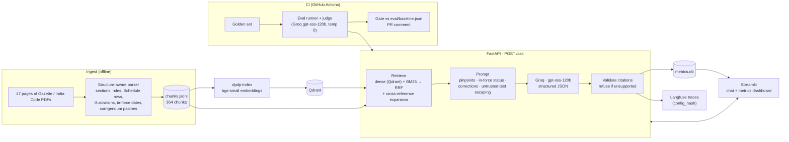

# dpdp-rag

Grounded question answering over India's **Digital Personal Data Protection Act, 2023**,
the **DPDP Rules, 2025** (G.S.R. 846(E)), the related notifications (G.S.R.
843/844/845(E)) and the corrigendum **G.S.R. 892(E)**. Every answer cites the exact
provision, says whether that provision is in force on a chosen date, and flags text the
corrigendum changed.

> **Not legal advice.** This tool explains what the published text says. It does not
> assess anyone's compliance. See [Limitations](#limitations).

## The problem

Privacy, compliance and product teams at Indian companies need to understand their
obligations under the DPDP regime. So do their lawyers, and the startups building
consent and data-protection tooling.

Plain keyword or PDF search isn't enough:

- **Obligations are spread across documents.** A rule only makes sense next to the Act
  section it modifies; Rule 12, for example, disapplies parts of Section 9.
- **Key facts live in tables.** Retention periods, for example, are in Schedule tables.
- **Commencement is staggered.** Provisions start on 2025-11-13, 2026-11-13 or
  2027-05-13, so a correct answer depends on the date it's asked.
- **The printed Rules were later corrected** by a corrigendum that refers to page and
  line numbers.

Plain search returns a page; this system returns a cited, date-aware answer from the
relevant provisions, and refuses when the text doesn't support one.

## Architecture



**Ingest.**
- PDFs are parsed with pymupdf into one chunk per section or sub-section, rule or
  sub-rule, Schedule row, Illustration and notification clause.
- Each chunk carries its pinpoint, its `in_force_date` (parsed from G.S.R. 843(E) and
  rule 1), and `refers_to` links to the Act sections it cites.
- The corrigendum's patches are applied to the affected chunks, with `text_original`
  kept. See [docs/ingestion.md](docs/ingestion.md).

**Retrieval.**
- Dense search in Qdrant and BM25 are fused with reciprocal rank fusion. A reranker is
  available but off by default.
- Metadata filters are supported.
- Retrieved rules pull in the Act sections they reference, e.g. Rule 12 → Section 9.
  See [docs/retrieval.md](docs/retrieval.md).

**Answering.**
- `openai/gpt-oss-120b` on Groq's free tier answers only from the supplied provisions, as
  strict structured output.
- In-force status for the as-of date is computed in code and given to the model.
- Citations are checked against what was retrieved. Unsupported answers and advice
  requests are refused, but the refusal still explains the text.
- Every response carries `latency_ms`, `tokens`, `cost_usd` and a `config_hash`. See
  [docs/api.md](docs/api.md).

**Observability.**
- One SQLite row per request goes to `data/metrics.db`.
- Each request is traced to Langfuse.
- A Streamlit dashboard shows p50/p99 latency, cost, refusal rate and eval trends.

**Quality gate.**
- A golden question set is scored for retrieval (recall@k, MRR) and for answers, by an
  LLM judge (faithfulness, relevance, refusal correctness).
- CI blocks PRs that regress past [configs/gates.yaml](configs/gates.yaml). See
  [docs/EVAL.md](docs/EVAL.md) and [docs/CI_DEMO.md](docs/CI_DEMO.md).

## Setup

```bash
git clone https://github.com/mishalsheza/dpdp_rag.git && cd dpdp_rag
cp .env.example .env          # add GROQ_API_KEY (Langfuse keys optional)
docker compose up --build     # Qdrant + one-shot indexer + API + UI
```

Then open:

- **UI:** <http://localhost:8501> (chat and metrics dashboard)
- **API:** <http://localhost:8000/docs>

The indexer embeds the committed `data/processed/chunks.jsonl` into Qdrant on first start
and exits. The API starts once it has finished.

**Re-ingest** (only if you change the parser or the PDFs):

```bash
docker compose run --rm api dpdp-ingest      # rebuilds data/processed/chunks.jsonl
docker compose run --rm indexer dpdp-index   # re-embeds into Qdrant
uv run dpdp-eval validate                    # golden questions must still match chunk ids
```

**Without Docker,** for development (Python 3.11 and [uv](https://docs.astral.sh/uv/)):

```bash
uv sync                                     # dev + ui dependency groups
docker compose up -d qdrant && uv run dpdp-index
uv run dpdp-api                             # http://127.0.0.1:8000
uv run streamlit run src/dpdp_rag/ui/app.py # http://localhost:8501
uv run pytest                               # 268 tests, offline (LLM mocked)
```

## Corpus

| Document | Pages | Chunks |
|---|---|---|
| DPDP Act, 2023: India Code text (sections 1–44 + penalty Schedule) | 25 | 202 |
| DPDP Rules, 2025: G.S.R. 846(E) (rules 1–23, Schedules 1–7) | 18 | 146 |
| Notifications G.S.R. 843(E) commencement, 844(E) Board, 845(E) Board size | 3 | 7 |
| Corrigendum G.S.R. 892(E), 8 patches applied to the Rules | 1 | 9 |
| **Total** | **47** | **364** |

- The Gazette copy of the Act (`act_2023_gazette.pdf`) is kept for reference but not
  indexed, because it duplicates the India Code text.
- Provenance of every file: [data/raw/SOURCES.md](data/raw/SOURCES.md).
- **Golden set: 12 questions** across 8 categories (lookup, cross-reference, table,
  temporal, corrigendum, scenario, unanswerable, prompt injection). They were written one
  at a time from the source text by Claude Code (an AI assistant), not by a human, and
  are **awaiting human review**. Four come from real chat questions the system answered
  poorly. See [docs/EVAL.md](docs/EVAL.md).

## Metrics

| Metric | Value | Source |
|---|---|---|
| End-to-end latency p50 / p99 (real model) | `‹TBD›` / `‹TBD›` ms | dashboard after real traffic |
| Serving-path latency p50 / p99 (stub LLM, 10 users) | **16 / 96 ms** | measured, [docs/LOADTEST.md](docs/LOADTEST.md) |
| Load-test throughput (stub LLM, 50 users) | **≥ 43 req/s**, 0 failures (not saturated) | measured, Apple M3, 1 worker |
| Cost per request (Groq free tier) | **$0** (≈ 2.8K tokens per question) | `cost_usd` / `tokens` in `/ask` responses |
| Cost per eval run (12 questions, uncached) | **$0** (free tier, rate-limited) | `results.json` → `cost` |

Eval scores by category (`uv run dpdp-eval run`, N = 1 per category):

| Category | recall@5 | MRR | Faithfulness (1–5) | Relevance (1–5) | Refusal correct |
|---|---|---|---|---|---|
| lookup | `‹TBD›` | `‹TBD›` | `‹TBD›` | `‹TBD›` | `‹TBD›` |
| cross_reference | `‹TBD›` | `‹TBD›` | `‹TBD›` | `‹TBD›` | `‹TBD›` |
| table | `‹TBD›` | `‹TBD›` | `‹TBD›` | `‹TBD›` | `‹TBD›` |
| temporal | `‹TBD›` | `‹TBD›` | `‹TBD›` | `‹TBD›` | `‹TBD›` |
| corrigendum | `‹TBD›` | `‹TBD›` | `‹TBD›` | `‹TBD›` | `‹TBD›` |
| scenario | `‹TBD›` | `‹TBD›` | `‹TBD›` | `‹TBD›` | `‹TBD›` |
| unanswerable | – | – | `‹TBD›` | – | `‹TBD›` |
| prompt_injection | `‹TBD›` | `‹TBD›` | `‹TBD›` | `‹TBD›` | `‹TBD›` |

Fill this table from the first CI run's `eval-results` artifact (`summary.md`). The same
numbers then become `eval/baseline.json`.

### CI: a regression blocked

The eval job posts a before/after table on every PR and fails it when retrieval or
answer quality drops past the gates.

<!-- Screenshot pending: follow docs/CI_DEMO.md ("Demo: a PR that the gate blocks"),
     save it as docs/img/ci-blocked-pr.png, then replace this comment with:
      -->
*Screenshot to be added after the first demo run (see [docs/CI_DEMO.md](docs/CI_DEMO.md)).*

## Ablations

Retrieval only, measured with `uv run dpdp-ablation` on 2026-10-09:

- **N = 7** golden questions with gold chunks, so one question is worth about 0.14.
- Local CPU models: `bge-small-en-v1.5` embeddings and the `ms-marco-MiniLM-L-6-v2`
  reranker.
- Fixed chunks are 1,000-character windows with 200 overlap. A fixed chunk counts as a
  hit when it covers at least 50% of a gold provision.

| Setup | Chunks | recall@1 | recall@5 | MRR | hit@5 | Answer faithfulness / relevance |
|---|---|---|---|---|---|---|
| Dense | structure-aware | 0.46 | **0.69** | **0.93** | **1.00** | `‹TBD›` |
| BM25 | structure-aware | 0.21 | 0.50 | 0.52 | 0.71 | `‹TBD›` |
| **Hybrid (RRF), default** | structure-aware | 0.39 | 0.68 | 0.76 | 0.86 | `‹TBD›` |
| Hybrid + reranker | structure-aware | 0.32 | 0.50 | 0.63 | 0.71 | `‹TBD›` |
| Dense | fixed 1,000 chars | 0.29 | 0.50 | 0.61 | 0.86 | `‹TBD›` |
| Hybrid (RRF) | fixed 1,000 chars | 0.36 | 0.68 | 0.65 | 0.86 | `‹TBD›` |

What it suggests, tentatively at this N:

- **Structure-aware chunks rank the right provision higher.** MRR is 0.93 vs 0.61 for
  dense, and only structure-aware chunks can carry pinpoints, dates and corrections.
- **The general-purpose reranker hurts on legal text.**
- **Dense alone beat hybrid here.** Hybrid stays the default until a larger golden set,
  with more citation-style questions, confirms or overturns this. See
  [docs/DECISIONS.md](docs/DECISIONS.md).

## Project structure

```
src/dpdp_rag/
  ingest/          PDF → chunks: parser, Act/Rules/notification chunkers, corrigendum, in-force dates, refs
  retrieval/       Qdrant index, BM25, hybrid fusion, reranker, filters, cross-ref expansion, caches
  generation/      prompts, pinpoints, in-force status, Groq client (+ Anthropic, stub), cost, answer validation
  api/             FastAPI app (/ask, /healthz, /version), config_hash, response cache
  observability/   Langfuse tracing
  metrics/         SQLite request metrics + p50/p99/cost helpers
  eval/            golden set, retrieval metrics, LLM judge, runner, gates, baseline, ablation, coverage
  ui/              Streamlit chat + metrics dashboard
configs/           default.yaml (system) · eval.yaml · gates.yaml · ci.yaml · docker.yaml · loadtest.yaml · ablation.yaml · ingest.yaml
prompts/           answer and judge prompts (all prompts live here)
data/raw/          source PDFs + SOURCES.md
data/processed/    chunks.jsonl, corrigendum_patches.json
data/golden.jsonl  golden questions
eval/baseline.json metrics CI compares against
loadtest/          locustfile
docs/              ingestion, retrieval, api, EVAL, CI_DEMO, LOADTEST, DECISIONS
tests/             268 tests (LLM mocked, Qdrant in memory)
.github/workflows/ lint + tests, eval gate
contributions/     change log per development step
```

## Limitations

- **Not legal advice.** The system explains the published text and declines compliance
  assessments, but it can still be wrong. Check the cited provisions and consult a
  qualified lawyer before relying on any answer.
- **The corpus is fixed.** It covers the documents above as published up to December
  2025. Later amendments, notifications, FAQs, Board orders and case law are not
  included. The India Code text is in English only.
- **Commencement is modelled per provision from G.S.R. 843(E) and rule 1.** Section 1(1)
  isn't listed in that notification and is dated to the Act's assent (see
  docs/ingestion.md).
- **The evaluation is small and unreviewed.** It has 8 AI-written questions, and the
  answers are scored by an LLM judge with known biases. The numbers show direction, not
  quality guarantees. See docs/EVAL.md.
- **Many numbers above are placeholders** until the first real runs (no API key was
  available while building).
- **Load-test figures use a stub LLM.** Real latency and throughput depend on Groq and
  its free-tier rate limits (requests and tokens per minute and per day).
- **No authentication or rate limiting on the API.** Run it locally or behind a gateway.

## Further reading

- [docs/EVAL.md](docs/EVAL.md): golden set, metric definitions, judge, limitations
- [docs/DECISIONS.md](docs/DECISIONS.md): why each major component was chosen, with the
  evidence
- [docs/CI_DEMO.md](docs/CI_DEMO.md): CI, the regression gate, baseline updates, the
  blocked-PR demo
- [docs/LOADTEST.md](docs/LOADTEST.md): load-test command and sample output
- [docs/ingestion.md](docs/ingestion.md) · [docs/retrieval.md](docs/retrieval.md) ·
  [docs/api.md](docs/api.md)
- [CLAUDE.md](CLAUDE.md): project conventions
